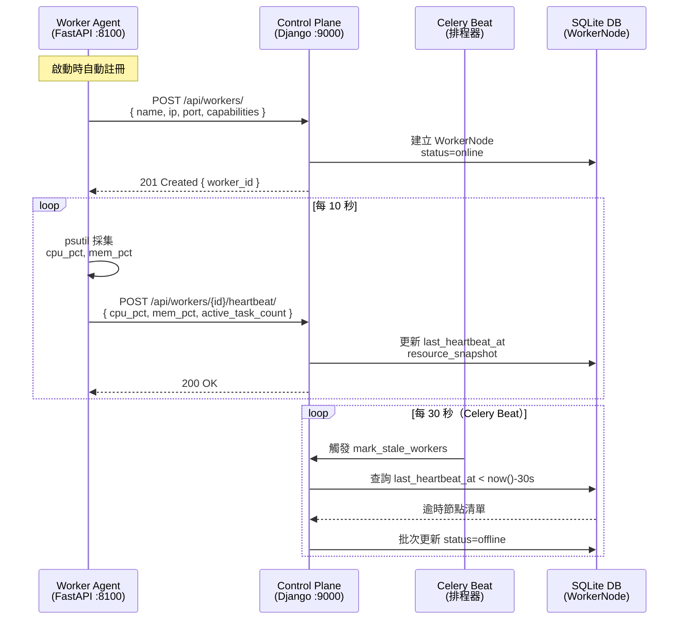
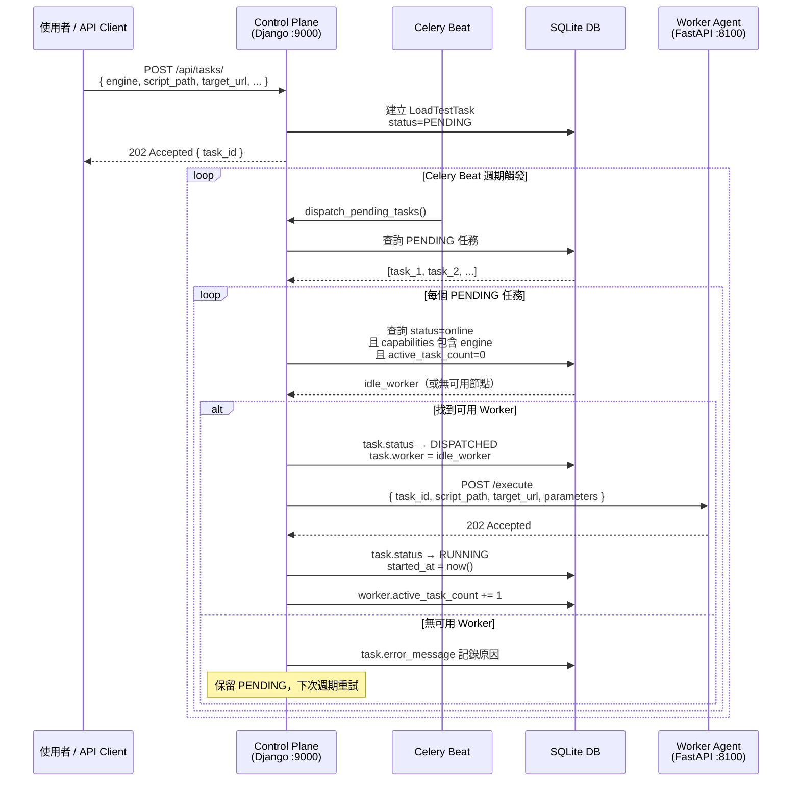
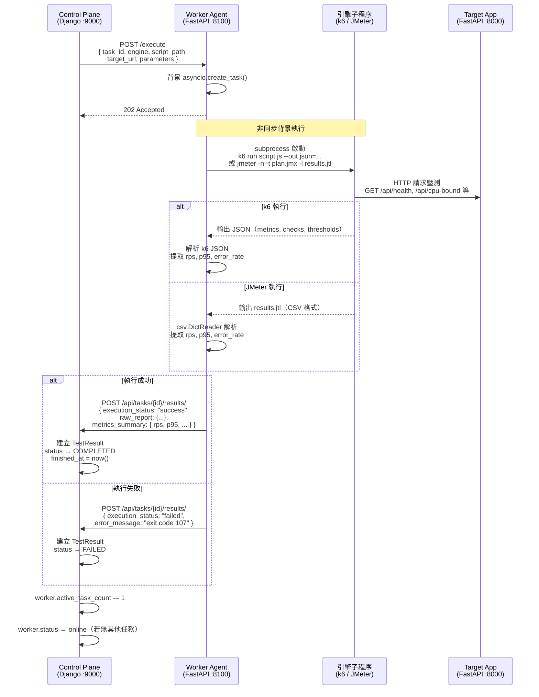
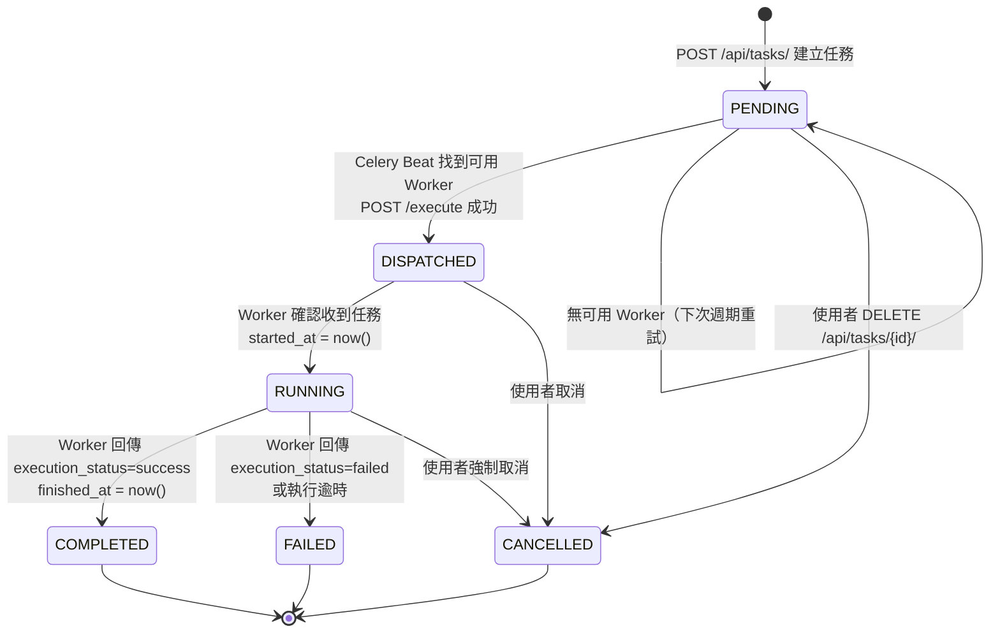
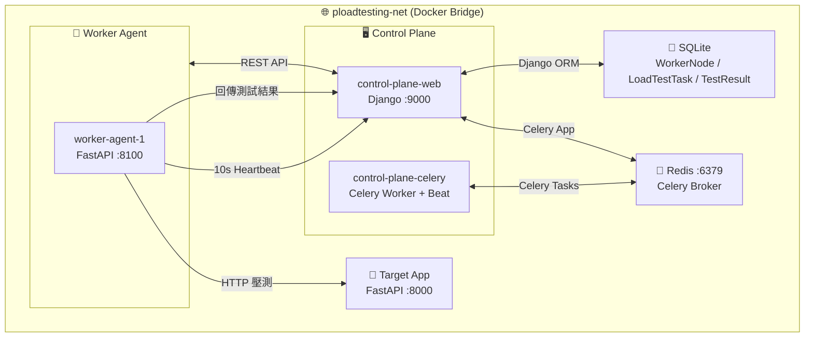

# 🏗️ 架構互動圖 — Control Plane 與 Worker Agent

> **pLoadtesting · 系統互動文件**
> 版本：1.0.0 · 對應版本：v0.1.0

本文件以 Mermaid 圖表描述 Control Plane 與 Worker Agent 之間的三大核心互動機制。

---

## 1. 心跳機制（Heartbeat）

Worker Agent 每 10 秒向 Control Plane 發送一次心跳，附帶當前 CPU/記憶體使用率。
Control Plane 的 Celery Beat 每 30 秒執行一次 `mark_stale_workers` 任務，將超時節點標記為 `offline`。

---

## 2. 任務派發循環（Task Dispatch）

`dispatch_pending_tasks` 由 Celery Beat 定期觸發，自動將 `PENDING` 任務派發至空閒且具備對應能力的 Worker。

---

## 3. 任務執行與結果回傳（Execution & Result Collection）

Worker Agent 在背景執行引擎腳本，完成後解析輸出指標並回傳 Control Plane。

---

## 4. LoadTestTask 狀態機

---

## 5. 系統拓撲概覽

