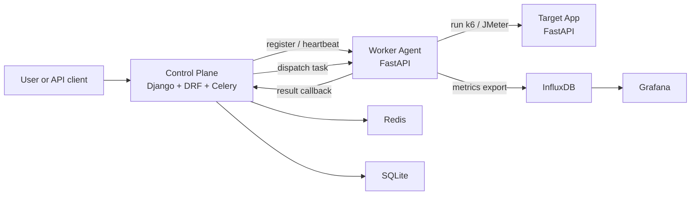

# pLoadtesting System Overview

This document consolidates the current system functional requirements and the live architecture of pLoadtesting into one operator-friendly overview.

## Purpose

pLoadtesting is a multi-engine load-testing ecosystem for running repeatable tests against an authorized target service, collecting execution results, and surfacing them through operational APIs and observability tools.

The current implementation centers on four cooperating parts:

- a reference target application that exposes predictable load scenarios
- a Control Plane that tracks workers, tasks, and results
- Worker Agents that execute k6 or JMeter workloads
- observability and CI layers that make the system repeatable and inspectable

## Functional Requirements

### Load Target

The target application must provide stable endpoints that generate different kinds of load:

- `GET /api/health` for readiness and smoke checks
- `GET /api/cpu-bound` for CPU-intensive behavior
- `GET /api/io-bound` for async wait / I-O-like behavior
- `POST /api/data` for larger JSON serialization and payload handling

These endpoints exist so the engines can exercise distinct performance shapes in a controlled way.

### Task Orchestration

The Control Plane must let clients create and inspect load-test tasks, then manage the task lifecycle from pending through completion or failure.

Current API surface:

- `GET /api/workers/`
- `POST /api/workers/`
- `POST /api/workers/<uuid>/heartbeat/`
- `GET /api/tasks/`
- `POST /api/tasks/`
- `GET /api/tasks/<uuid>/`
- `POST /api/tasks/<uuid>/results/`

Core requirements:

- tasks capture `engine`, `script_path`, `parameters`, `target_url`, and optional scheduling metadata
- task creation always starts from `pending`
- result submission updates the task terminal state and stores parsed metrics plus raw report data
- read and write API requests require the shared preview token when configured

### Worker Management

Workers must be able to self-register and report health.

Required behavior:

- register with name, address, port, and supported capabilities
- renew heartbeat state periodically
- expose current status, active task count, and resource snapshot
- allow the Control Plane to distinguish online, busy, offline, and draining workers

### Execution Engines

Workers must be able to execute at least two engines:

- k6
- JMeter

The current data model also includes `loadrunner` as a future-compatible engine enum value, but there is no corresponding runtime integration yet.

### Metrics and Reporting

The system must preserve both raw and derived results:

- raw engine output for later re-interpretation
- summary metrics for dashboards and API consumers

Current summary fields include:

- total and failed request counts
- error rate
- average, p90, p95, p99, and max response times
- throughput
- peak virtual users
- threshold pass/fail details

### Observability and Delivery

The platform should support local observability and automated verification:

- Redis for Celery dispatch and background tasks
- InfluxDB for time-series result export
- Grafana for result visualization
- GitHub Actions for CI validation
- Docker Compose for local reproduction

## Architecture

### Component Responsibilities

| Component | Responsibility |
|---|---|
| Target App | Provides deterministic CPU, I/O, and JSON response scenarios for load generation. |
| Control Plane | Owns worker registry, task lifecycle, result persistence, and API access control. |
| Worker Agent | Registers with the Control Plane, maintains heartbeat, runs the selected engine, and returns results. |
| Redis | Backing queue for Celery task coordination. |
| SQLite | MVP persistence for worker, task, and result records. |
| InfluxDB | Time-series store for operational and task-summary metrics. |
| Grafana | Operational dashboard for reviewing results. |

### Core Data Model

The system revolves around three persistent entities:

- `WorkerNode`: registered execution node, status, capabilities, and heartbeat state
- `LoadTestTask`: task definition, target URL, engine, scheduling metadata, and execution lifecycle
- `TestResult`: raw engine output plus parsed summary metrics and threshold outcomes

### Execution Flow

1. A client creates a `LoadTestTask`.
2. The Control Plane stores it in `pending`.
3. Celery dispatch selects an online worker that supports the requested engine.
4. The Worker Agent executes the script against the target app.
5. The Worker returns a result payload to the Control Plane.
6. The Control Plane persists `TestResult` and marks the task `completed` or `failed`.
7. Optional metrics export feeds InfluxDB and Grafana.

## Current Boundaries

- The repository is currently MVP-oriented, not production-hardened.
- The shared token protects preview API traffic, but there is no full production auth system yet.
- `loadrunner` is modeled in the task enum, but the runtime path is not implemented.
- The system assumes controlled, authorized test targets only.

## Source Material Used

This overview was synthesized from the current repository code and existing documentation, especially:

- root `README.md`
- `control-plane/ARCHITECTURE.md`
- `control-plane/config/urls.py`
- `control-plane/apps/*/models.py`
- `control-plane/apps/*/views.py`
- `workers/agent.py`
- `target-app/main.py`
